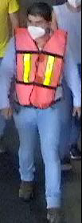

# automatic_labelsKitti

Etiquetador automatico de kitti:

Tomara imagenes del siguiente tipo, dentro de un directorio "data" o como se llame (esta configurable):



Y generara labels en formato kitti, se supondra para todas las imagenes una posicion "tipo" de la cabeza y el pecho. 
El programa aparte de generar los txt, tomara el tamaño promedio y les hara un resize a todas, y ademas cambiara el formato a png 
para utilizar vips para hacer el rizase.
El programa etiqueta solo una clase por ejecucion.


# Requirements
```
wget https://github.com/libvips/libvips/releases/download/v8.10.6/vips-8.10.6.tar.gz
tar xf vips-8.10.6.tar.gz
cd vips-8.10.6/
sudo apt-get install build-essential pkg-config glib2.0-dev libexpat1-dev
./configure
```

You’ll need the dev packages for the file format support you want. For basic jpeg and tiff support, you’ll need libtiff5-dev, libjpeg-turbo8-dev, and libgsf-1-dev. See the Dependencies section below for a full list of the things that libvips can be configured to use.
In https://libvips.github.io/libvips/install.html

```
make
sudo make install
sudo ldconfig
```
# Ejecucion


-d = directorio con imagenes de un clase en particular
-c = clase en particular (casco o chaleco)


```
go mod tidy
go run . -d data -c chaleco

```
